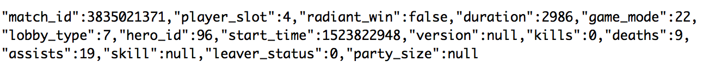
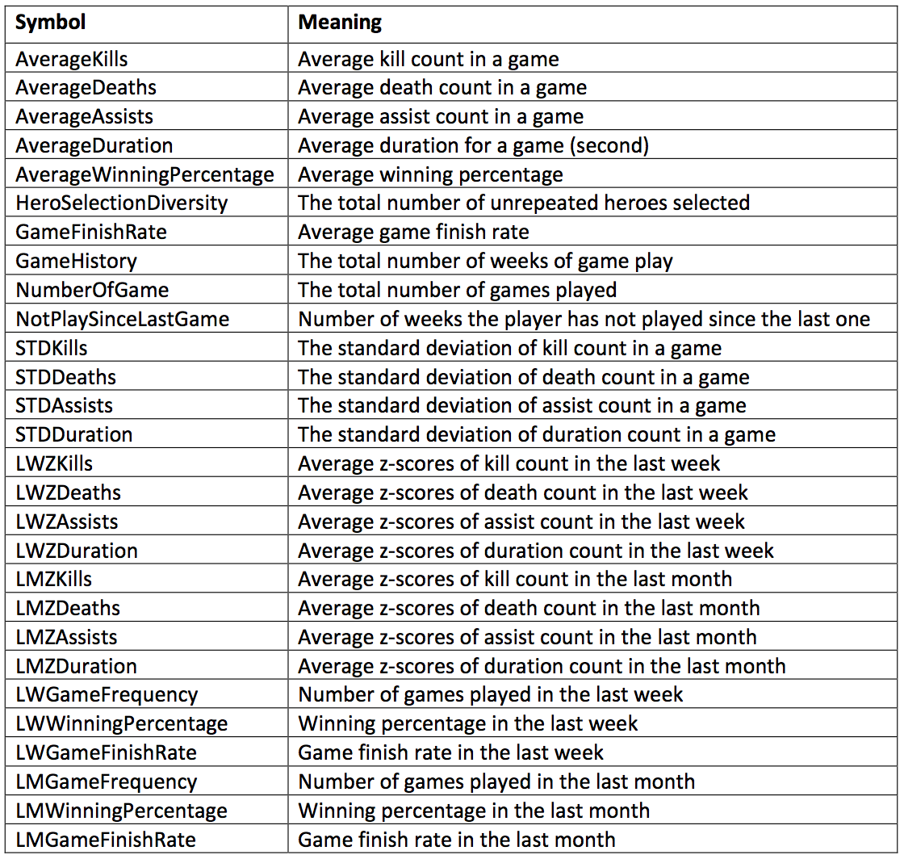

# DOTA2-Player-Survival-Rate-Analysis
Final Project for CMU 19704

In this project, we analyze DotA players' data downloaded from the OpenDotA website, where we can get access to over a million DotA players data ever since their first game. Our goal is to build a logistic regression model to predict when a player will decide to quit the game. In total we downloaded 35352 players’ data (https://docs.opendota.com/#). Each player has one json file which contains all games that player was ever involved. Each game has a data point in the json file, formatted as follows:

Using the python script, we calculated independent variables: 

We applied 20/60/20 rule to our data analysis and finally got a model with 81% prediction accuracy. More details of the analysis can be found in the report: https://github.com/yangz3/DOTA2-Player-Survival-Rate-Analysis/blob/master/Report.pdf
